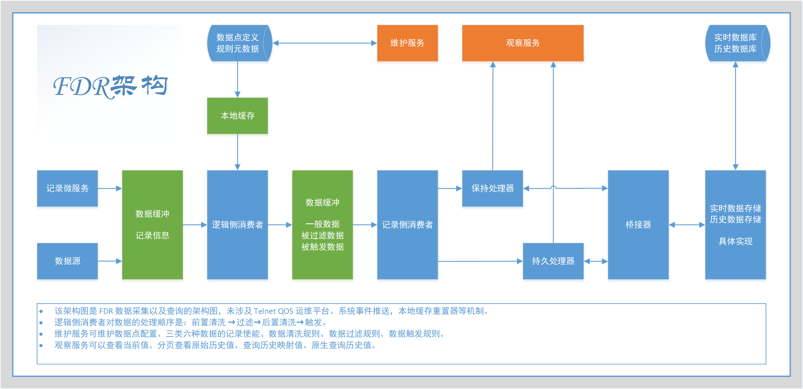

# FDR Introduction - FDR 简介

FDR 是一款开箱即用的数据收集的解决方案。

FDR 运行后，您可以通过程序提供的操作接口维护数据点，定义数据点的存储策略、清洗策略、过滤策略、触发策略，
随后您可以上线数据记录功能。

FDR 数据记录功能上线后，能从多种数据源中收集数据，处理数据，记录数据，并提供数据的查询接口。

您知道吗？

FDR 是飞行术语，指的是“飞行数据记录器（flight-data-recorder）”，常被称为“黑匣子”。

> 现代商用飞机一般安装两个黑匣子，分别是“驾驶舱语音记录器”和“飞行数据记录器”，用于航空器事故的调查、维修和飞行试验。
> 黑匣子可以用来记录飞机在飞行过程中的各种参数，如飞行的时间、速度、高度、飞机倾斜度、发动机的转速及温度等，
> 以及驾驶员与乘务人员和各个塔台之间的对话等。
> 当飞机发生故障或事故时，找到黑匣子，从中读出记录的各种数据，能够帮助技术人员分析飞机出现故障或失事的原因。

真实的 FDR 长这样：

---

## 国际化（I18N）

您正在阅读的文档是中文文档，您可以在 [wiki](./docs/wiki) 目录下找到其他语言的文档。

You are reading the Chinese document, you can find documents in other languages in the [wiki](./docs/wiki) directory.

- [简体中文](docs/wiki/zh-CN/Introduction.md)
- [English](docs/wiki/en-US/Introduction.md)

## 特性

- 数据点的采集策略高度可配置，支持自定义清洗策略、过滤策略、触发策略，满足各种数据采集需求。
- 分布式架构，可部署多个节点，满足不同规模的数据采集需求。
- 多数据源支持，可以从多种途径获取数据。
- 数据值支持多种类型，如：整型、浮点型、布尔型、字符串等。
- 高性能架构，数据分析与数据记录均采用多线程模型，单节点处理能力强。
- 采用桥接器模式记录数据，支持多种数据存储方式，满足不同的数据存储需求。
- 提供系统事件，可通过第三方组件监听系统事件，实现更多的功能。
- 提供数据查询接口，可以直接通过提供的服务查询数据点的实时值和历史值。
- 提供数据映射查询接口，可以直接通过提供的服务对一段时间内的数据进行映射查询，包括开窗查看、占空比查询、高通查询、低通查询等。
- 提供基于 `telnet` 的运维平台，可以通过 `telnet` 连接到运维平台，设置关键参数，查看系统状态。

## 系统架构

FDR 的系统架构如下图所示：

## 文档

该项目的文档位于 [docs](./docs) 目录下，包括：

### wiki

wiki 为项目的开发人员为本项目编写的详细文档，包含不同语言的版本，主要入口为：

1. [简介](docs/wiki/zh-CN/Introduction.md) - 镜像的 `README.md`，与本文件内容基本相同。
2. [目录](docs/wiki/zh-CN/Contents.md) - 文档目录。

## 运行截图

Telnet 运维平台指令合集：

逻辑侧消费者服务状态：

记录侧消费者服务状态：

在 Telnet 运维平台中对数据进行开窗查询：

