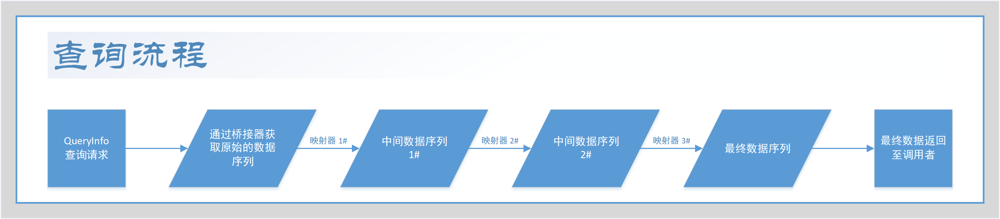
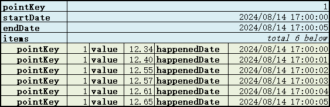
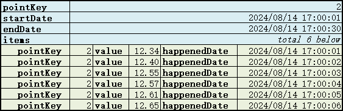

# Mapper - 映射器

## 说明

Mapper 是一个用于将数据从一个数据结构转换为另一个数据结构的工具，它是查询（query）的核心组件。

Mapper 可以操作数据序列，用于将数据序列转换为另一个数据序列，以减少数据量，或是更直观地展示数据。

Mapper 源自 FDR 1.x，但是 FDR 2.x 对映射器机制进行了重构，使得映射器更加灵活。

一个查询（query）的流程如下：

1. 查看服务接收到查询请求，查询请求分为两部分：查询条件和映射器配置列表。
2. 服务根据查询条件从数据源获取原始数据，并且将原始数据转换为原始数据序列。
3. 根据映射器配置列表，获取所有映射器。
4. 遍历每个映射器，分别对上一个数据序列进行映射，得到下一个数据序列，交给下一个映射器。
5. 最后一个映射器将数据序列转换为查询结果，返回给服务。

下图是查询流程图：



## QueryInfo

QueryInfo 是一个查询信息的封装类，用于存储查询条件和映射器配置列表，其结构如下：
```java
String preset;              // 预设。
String[] params;            // 参数。
List<LongIdKey> pointKeys;  // 数据点组件组成的列表。
Date startDate;             // 开始时间。
Date endDate;               // 结束时间。
boolean includeStartDate;   // 是否包含开始时间。
boolean includeEndDate;     // 是否包含结束时间。
List<MapInfo> mapInfos;     // 映射器配置列表。
```

其中，MapInfo 是一个映射器配置的封装类，用于存储映射器的配置信息，其结构如下：

```java
String type;                // 映射器类型。
String param;               // 映射器参数。
```
## 数据序列

数据序列（Sequence）是映射器的输入和输出，其结构如下：

```java
LongIdKey pointKey;         // 数据点主键。
List<Item> items;           // 数据序列条目列表。
Date startDate;             // 序列开始时间。
Date endDate;               // 序列结束时间。
```

其中，Item 是一个数据序列条目的封装类，用于存储数据序列的条目，其结构如下：

```java
LongIdKey pointKey;         // 数据点主键。
Object value;               // 数据值。
Date happenedDate;          // 数据发生时间。
```

以下是一个直观的数据序列示意图：



一般来说，数据序列 Item 中的 pointKey 与 Sequence 中的 pointKey 是相同的。

Sequence 中的 startDate 和 endDate 表示数据序列的时间范围， items 中的 happenedDate 表示数据条目的发生时间。
通常来说，二者没有直接关系，Sequence 中的起止时间范围可能大于 items 中的发生时间范围，也可能小于。

以下是直观的数据序列示意图，展示了 Sequence 中的时间范围与 items 中的发生时间范围的关系：




## 映射器的生命周期

映射器拥有本地缓存，使用懒加载机制，当映射器第一次被调用时，会加载映射器的配置信息，并且初始化映射器。

当映射器被初始化后，会一直保持在内存中，直到服务关闭，或是通过管理接口手动重置或清除映射器。

## 参阅

- [HowToUseTelqosViewCommand.md](./HowToUseTelqosViewCommand.md) - 如何使用 Telqos 的观察命令。
