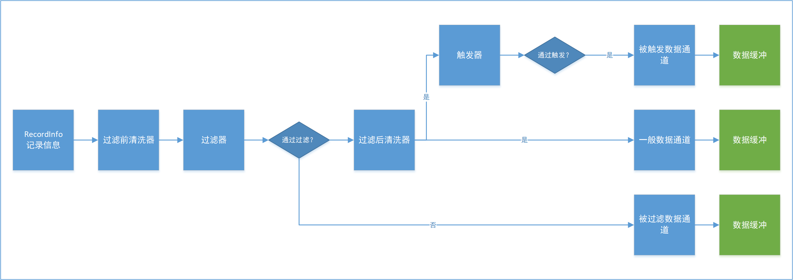

# Washer - 清洗器

## 说明

清洗器用于在记录链路中对单条数据的值（`Object`）进行转换或校验，并将结果写回 `RecordInfo`。
典型用途包括类型转换、脚本清洗，以及与过滤器配合标记不合法数据等。

清洗器是数据处理流程中的一个环节，整个流程如下：



清洗器有两种类型，分别是过滤前清洗器和过滤后清洗器。
过滤前清洗器在数据过滤处理之前进行清洗，过滤后清洗器在数据过滤处理之后进行清洗。
过滤前清洗器通常用于数据检查，过滤后清洗器通常用于数据修正。
通过 `WasherInfo#setPreFilter(boolean)` 方法可以设置清洗器的类型。

## WasherInfo

`WasherInfo` 描述某个点位上的一条清洗器配置，关键字段如下：

| 字段          | 说明                                  |
|-------------|-------------------------------------|
| `key`       | 清洗器信息主键。                            |
| `pointKey`  | 所属点位主键。                             |
| `index`     | 同点位内的执行顺序，数值越小越先执行。                 |
| `enabled`   | 是否启用；仅 `enabled=true` 的配置参与记录链路。    |
| `preFilter` | 是否为过滤前清洗器；`true` 为过滤前，`false` 为过滤后。 |
| `type`      | 清洗器类型标识，由具体实现注册。                    |
| `param`     | 清洗器参数，通常为 JSON 字符串。                 |
| `remark`    | 备注。                                 |

启用清洗器按 `index` 升序加载，并分别归入过滤前或过滤后清洗器映射。

## 接口

清洗器 `Washer` 是一个接口，主要方法如下：

| 方法签名                                                              | 说明                        |
|-------------------------------------------------------------------|---------------------------|
| `void init(Context context)`                                      | 构建后初始化，保存上下文。             |
| `WashResult wash(WashInfo washInfo) throws WasherException`       | 清洗数据，当前推荐使用。              |
| `@Deprecated Object wash(Object rawValue) throws WasherException` | 已废弃，请改用 `wash(WashInfo)`。 |

具体方法的说明请参阅接口的 JavaDoc。

### WashInfo

`WashInfo` 封装一次清洗所需的输入信息，结构如下：

```java
public final class WashInfo {

    private final LongIdKey pointKey;
    private final Object value;
    private final Date happenedDate;
    private final int happenedDateNanoOffset;

    public WashInfo(
            LongIdKey pointKey, Object value, Date happenedDate, int happenedDateNanoOffset
    ) {
        this.pointKey = pointKey;
        this.value = value;
        this.happenedDate = happenedDate;
        this.happenedDateNanoOffset = happenedDateNanoOffset;
    }

    // getter 省略
}
```

| 字段                       | 说明                                          |
|--------------------------|---------------------------------------------|
| `pointKey`               | 点位主键。                                       |
| `value`                  | 待清洗的值。                                      |
| `happenedDate`           | 数据发生时间。                                     |
| `happenedDateNanoOffset` | 毫秒内纳秒偏移（3.0.0 起）；与 `happenedDate` 共同确定发生时刻。 |

### WashResult

`WashResult` 封装清洗结果，结构如下：

```java
public final class WashResult {

    private final Object value;

    public static WashResult of(Object value) {
        return new WashResult(value);
    }

    public WashResult(Object value) {
        this.value = value;
    }

    public Object getValue() {
        return value;
    }
}
```

记录链路在 `washResult` 为 `null` 时，会将 `RecordInfo` 的值写为 `null`。

### Context

`Context` 为清洗器提供运行时上下文，主要方法如下：

| 方法签名                                                        | 说明           |
|-------------------------------------------------------------|--------------|
| `List<RecordMemory> lookupRecordMemory(LongIdKey pointKey)` | 查询指定点位的记录记忆。 |

返回列表按时间从新到旧排列，索引 `0` 对应最新记录。调用者应只读使用返回结果，不应修改列表内容。

## 清洗器的生命周期

### 初始化

当一个 `RecordInfo` 对象被逻辑侧消费者处理时，消费者会根据 `RecordInfo.getPointKey()` 获取点位主键。
点位对应 FDR 配置的数据点信息，一个数据点可关联多条清洗器信息、过滤器信息和触发器信息。

在大部分情况下，一个数据点关联的清洗器、过滤器和触发器会以 `RecordLocalCache` 的形式，缓存在 `RecordLocalCacheHandler` 中。
若缓存不存在，`RecordLocalCacheHandler` 会查询该点位已启用的清洗器、过滤器、触发器信息，并生成对应实例。

| 信息实体          | 生成的对象     | 生成处理器            |
|---------------|-----------|------------------|
| `WasherInfo`  | `Washer`  | `WasherHandler`  |
| `FilterInfo`  | `Filter`  | `FilterHandler`  |
| `TriggerInfo` | `Trigger` | `TriggerHandler` |

对于清洗器，`WasherHandler` 会根据 `WasherInfo` 的 `type` 和 `param` 字段生成实例。
`WasherHandlerImpl` 在 `make` 成功后会调用 `washer.init(washerContext)`，
注入的上下文可通过 `lookupRecordMemory` 查询记录记忆，详见 [Record Memory](./RecordMemory.md)。

生成的 `RecordLocalCache` 包含 `preFilterWasherMap`、`filterMap`、`postFilterWasherMap` 与 `triggerMap`，
记录链路由 `RecordProcessor` 消费 `RecordInfo` 时按此结构执行。

### 销毁

`RecordLocalCacheHandler` 维护记录本地缓存，其中保存各点位的 `RecordLocalCache`（含清洗器、过滤器、触发器实例）。

在大部分情况下，缓存没有过期时间。
除非调用 `RecordLocalCacheHandler.remove` 或 `RecordLocalCacheHandler.clear()`，否则记录上下文不会被销毁。

记录功能重置（`ResetProcessor.resetRecord`）会调用 `RecordLocalCacheHandler.clear()`，
同时调用 `recordMemoryHandler.clear()` 清空记录记忆。
此时所有 `RecordLocalCache` 被释放，清洗器实例随之销毁。

## 工作机制

### 记录链路顺序

单条 `RecordInfo` 在记录链路中的处理顺序如下：

1. 过滤前清洗器（`preFilter=true`，按 `index` 升序）。
2. 过滤器（任一过滤器判定为被过滤则终止一般数据路径）。
3. 过滤后清洗器（`preFilter=false`，按 `index` 升序）。
4. 触发器。

### 过滤前清洗器

过滤前清洗器在数据被过滤之前执行。
FDR 读取 `RecordInfo.getValue()`，按顺序调用各清洗器的 `wash(WashInfo)`，并将输出写回 `RecordInfo`。
前一个清洗器的输出作为后一个清洗器的输入。

调用方式示例如下：

```java
public class WasherUsageExample {

    private void washPreFilter(
            Washer washer, LongIdKey pointKey, RecordInfo recordInfo
    ) throws WasherException {
        Washer.WashInfo washInfo = new Washer.WashInfo(
                pointKey,
                recordInfo.getValue(),
                recordInfo.getHappenedDate(),
                recordInfo.getHappenedDateNanoOffset()
        );
        Washer.WashResult washResult = washer.wash(washInfo);
        Object washedValue = washResult == null ? null : washResult.getValue();
        recordInfo.setValue(washedValue);
    }
}
```

过滤前清洗器处理的数据可能无效，因此常与过滤器配合使用，推荐流程如下：

1. 过滤前清洗器发现数据不合法时，返回 `null`，或 SDK 提供的特殊值
   `com.dwarfeng.fdr.sdk.util.Constants#DATA_VALUE_ILLEGAL`。
2. 配置 `data_value_illegal_filter` 等过滤器识别上述特殊值并拒绝该数据。

*当前置清洗器认定数据不合法时，应返回可识别的特殊值，而不应为此抛出异常。*

若因无法调用外部服务等原因无法完成清洗流程，应抛出 `WasherException`，由框架按记录失败流程处理。

### 过滤后清洗器

过滤后清洗器在数据被过滤之后执行。
FDR 同样读取 `RecordInfo.getValue()`，
按照过滤后清洗器预设的顺序（`preFilter=false`，按 `index` 升序）依次调用 `wash(WashInfo)` 并写回结果。

与过滤前清洗器不同的是，非法数据通常已被过滤器剔除，后置清洗器侧重对已通过过滤的数据做修正。

## 参阅

- [Filter](./Filter.md) - 过滤器，详细说明了本项目的过滤器机制。
- [Opt Directory](./OptDirectory.md) - 可选配置目录说明，详细介绍了本项目的可选配置，即 `opt/` 目录下的内容。
- [Record Memory](./RecordMemory.md) - 记录记忆，说明记录记忆的结构、工作机制与运维要点。
- [Telqos Commands](./TelqosCommands.md) - Telqos 命令，详细说明了本项目的 Telqos 命令。
