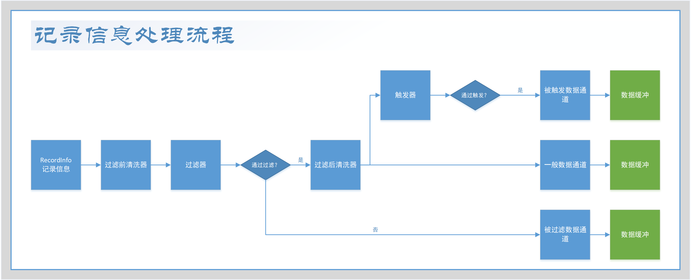

# Washer - 清洗器

## 说明

清洗器是一种用于清洗数据的工具，它可以对数据进行一些预处理，例如去除空行、去除重复行、去除空格、去除特殊字符等。

清洗器的核心方法是将记录信息的值转换为另一个值。例如，将字符串转换为小写，将字符串转换为数字，将字符串转换为日期等。

清洗器是数据处理流程中的一个环节，整个流程如下：

清洗器有两种类型，分别是过滤前清洗器和过滤后清洗器。
过滤前清洗器在数据过滤处理之前进行清洗，过滤后清洗器在数据过滤处理之后进行清洗。
过滤前清洗器通常用于数据检查，过滤后清洗器通常用于数据修正。
通过 `WasherInfo#setPreFilter(boolean)` 方法可以设置清洗器的类型。

## 接口

清洗器 `Washer` 是一个接口，有如下方法：

| 方法签名                                                  | 说明   |
|-------------------------------------------------------|------|
| `Object wash(Object rawValue) throws WasherException` | 清洗数据 |

具体方法的说明请参阅接口的 JavaDoc。

## 清洗器的生命周期

### 初始化

当一个 `RecordInfo` 对象被逻辑侧消费者处理时，逻辑侧消费者会根据 `RecordInfo.getPointKey` 方法获取到该记录信息的点键。
数据点键对应的是 FDR 配置的数据点信息，一个数据点与多个清洗器信息、过滤器信息和触发器信息关联。

对于大部分情况，一个数据点关联的清洗器、过滤器和触发器会以记录上下文的形式被存放在 `RecordLocalCacheHandler` 中。
一旦 `RecordLocalCacheHandler` 中不存在该记录上下文，则 `RecordLocalCacheHandler`
会查询数据点关联的具体的清洗器信息、过滤器信息和触发器信息，并依据这些信息生成对应的清洗器、过滤器和触发器。

| 信息实体        | 生成的对象   | 生成处理器          |
|-------------|---------|----------------|
| WasherInfo  | Washer  | WasherHandler  |
| FilterInfo  | Filter  | FilterHandler  |
| TriggerInfo | Trigger | TriggerHandler |

对于清洗器而言，`WasherHandler` 会根据 `WasherInfo` 中的 `type` 和 `param` 字段，生成对应的清洗器。

### 销毁

`RecordLocalCacheHandler` 维护了一个记录上下文的缓存，一个数据点对应的清洗器、过滤器和触发器均被存储在该上下文中。

在大部分情况下，被缓存的记录上下文会一直被保存在 `RecordLocalCacheHandler` 中，`RecordLocalCacheHandler`
中的缓存没有过期时间。除非调用 `RecordLocalCacheHandler.remove` 方法或 `RecordLocalCacheHandler.clear` 方法，
否则缓存中的记录上下文不会被销毁。

`RecordLocalCacheHandler.clear` 会通过 FDR 的重置机制按照预设的逻辑进行调用，届时，
`RecordLocalCacheHandler` 中的缓存会被清空，所有的记录上下文会被销毁。清洗器的销毁会随着记录上下文的销毁而销毁。

## 工作机制

### 过滤前清洗器

过滤前清洗器会在数据被过滤之前执行，FDR 会调用 `RecordInfo.getValue` 方法，获取记录信息的值。
按照过滤器前清洗器预设的顺序依次调用 `Washer.wash` 方法，对记录信息的值进行清洗。前一个清洗器的输出会作为后一个清洗器的输入。

过滤前清洗器与过滤后清洗器最大的区别在于：过滤前清洗器处理的数据有可能是无效的，
因此过滤器前清洗器在一定程度上需要对数据进行检查。一般情况下，推荐使用过滤前清洗器与过滤器配合使用，可以参照以下流程：

1. 过滤前清洗器对数据进行清洗，如在清洗过程中发现数据不合法，则返回一个特殊的对象用于告知过滤器，
   FDR 的 sdk 模块提供了这种特殊对象：`Constants.DATA_VALUE_ILLEGAL`。
2. 过滤器对数据进行过滤，只要数据对象不是 `Constants.DATA_VALUE_ILLEGAL`，则通过过滤，否则不通过过滤。

*当前置清洗器认定数据不合法时，应该按照上文返回可用于识别的特殊对象，而不应该抛出异常。*

### 过滤后清洗器

过滤后清洗器会在数据被过滤之后执行。

FDR 会调用 `RecordInfo.getValue` 方法，获取记录信息的值。
按照过滤器前清洗器预设的顺序依次调用 `Washer.wash` 方法，对记录信息的值进行清洗。前一个清洗器的输出会作为后一个清洗器的输入。

与过滤前清洗器不同的是，由于前方的过滤器会过滤掉所有的非法数据，因此，后置清洗器不需要对数据进行检查。

## 参阅

待补充
