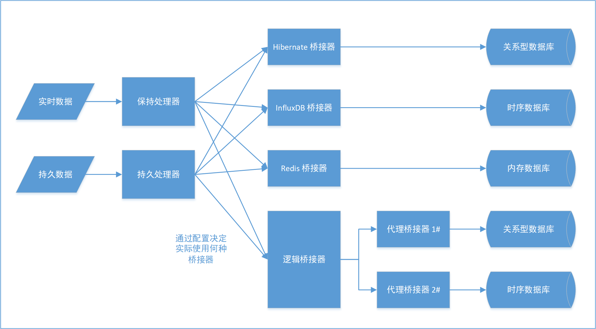

# Bridge - 桥接器

## 说明

桥接器是数据读写的桥梁，用于将实时数据或历史数据以不同的方式进行存储和读取。

在 FDR 2.x 中，数据不再直接存储在关系型数据库中，而是基于桥接器提供的接口对数据进行交互，不同的桥接器实现了不同的数据存储方式，
例如：关系型数据库、时序数据库、Redis 等。

下图是桥接器的架构图：



FDR 启动时，会根据配置文件加载所有被扫描的桥接器，每个桥接器都可以支持一种类型（也可以支持多种类型，但是不常见），
FDR 的数据可以分为六个主题，每个主题都可以指定特定桥接器用于数据交互。数据主题如下：

- 一般实时数据。
- 一般持久数据。
- 被过滤实时数据。
- 被过滤持久数据。
- 被触发实时数据。
- 被触发持久数据。

在 `conf/fdr/bridge.properties` 配置文件中，可以配置每个数据主题对应的桥接器，其配置实例摘录如下：

```properties
###################################################
#                     global                      #
###################################################
# 桥接器的类型。
# 目前支持的类型有:
#   drain: 简单地丢弃所有数据，通常用作占位符（如不想保留某类型的数据，则可以在对应类型上配置 drain）。支持保持器和持久器。
#   mock: 仅用于测试，不会真正持久数据，查询时返回随机数据。支持保持器和持久器。
#   hibernate: 使用 hibernate 框架持久数据，可适配多种不同类型的数据库。支持持久器。
#   influxdb: 使用 influxdb 框架持久数据。支持持久器。
#   redis: 使用 redis 维护实时数据。支持保持器。
#   kafka: 使用 kafka 接收消息的推送。支持保持器和持久器。只支持写入，不支持读取。
#   multi: 多重桥接器，将数据写入代理的所有桥接器，并从代理的第一个桥接器读取数据。
#
# 可以为一般数据、被过滤数据、被触发数据分别指定保持器类型。
# 对于一个具体的项目，很可能只需要一种保持器。此时如果希望程序加载时只加载这一种保持器，可以通过编辑
# opt/opt-bridge.xml 文件实现。
keep.normal_data.type=mock
persist.normal_data.type=mock
keep.filtered_data.type=mock
persist.filtered_data.type=mock
keep.triggered_data.type=mock
persist.triggered_data.type=mock
```

## 接口

桥接器 `Bridge` 是一个接口，总体来说，桥接器用于提供保持器和持久器，其中，保持器用于与实时数据交互，持久器用于与历史数据交互。

需要注意的是，不是所有的桥接器都支持所有的数据类型，比如 Redis 桥接器只支持保持器，不支持持久器。

桥接器有如下方法：

| 方法签名                                                                           | 说明              |
|--------------------------------------------------------------------------------|-----------------|
| `boolean supportType(String type)`                                             | 返回桥接器是否支持指定的类型  |
| `Keeper<NormalData> getNormalDataKeeper() throws HandlerException`             | 获取桥接器的一般数据保持器   |
| `Keeper<FilteredData> getFilteredDataKeeper() throws HandlerException`         | 获取桥接器的被过滤器数据保持器 |
| `Keeper<TriggeredData> getTriggeredDataKeeper() throws HandlerException`       | 获取桥接器的被触发器数据保持器 |
| `Persister<NormalData> getNormalDataPersister() throws HandlerException`       | 获取桥接器的一般数据持久器   |
| `Persister<FilteredData> getFilteredDataPersister() throws HandlerException`   | 获取桥接器的被过滤器数据持久器 |
| `Persister<TriggeredData> getTriggeredDataPersister() throws HandlerException` | 获取桥接器的被触发器数据持久器 |

具体方法的说明请参阅接口的 JavaDoc。

桥接器需要提供一般数据、被过滤数据和被触发数据的保持器，以上保持其均继承保持器 `Keeper` 接口，保持器接口如下：

| 方法签名                                                                | 说明   |
|---------------------------------------------------------------------|------|
| `void update(D data) throws HandlerException`                       | 更新数据 |
| `void update(List<D> datas) throws HandlerException`                | 更新数据 |
| `D latest(LongIdKey pointKey) throws HandlerException`              | 查询数据 |
| `List<D> latest(List<LongIdKey> pointKeys) throws HandlerException` | 查询数据 |

其中，`D` 为数据类型，`LongIdKey` 为数据点键。

具体方法的说明请参阅接口的 JavaDoc。

桥接器需要提供一般数据、被过滤数据和被触发数据的持久器，以上持久器均继承持久器 `Persister` 接口，持久器接口如下：

| 方法签名                                                                                      | 说明   |
|-------------------------------------------------------------------------------------------|------|
| `void record(D data) throws HandlerException`                                             | 记录数据 |
| `void record(List<D> datas) throws HandlerException`                                      | 记录数据 |
| `LookupResult<D> lookup(LookupInfo lookupInfo) throws HandlerException`                   | 查看   |
| `List<LookupResult<D>> lookup(List<LookupInfo> lookupInfos) throws HandlerException`      | 查看   |
| `QueryResult nativeQuery(NativeQueryInfo queryInfo) throws HandlerException`              | 原生查询 |
| `List<QueryResult> nativeQuery(List<NativeQueryInfo> queryInfos) throws HandlerException` | 原生查询 |

## 桥接器的生命周期

桥接器的生命周期与 FDR 的生命周期一致，桥接器的初始化和销毁由 FDR 负责。

当 FDR 启动时，加载所有被扫描的桥接器，此时桥接器被初始化，即使采集功能被设置为不上线，桥接器也不会被销毁。

当 FDR 关闭时，会等待逻辑侧消费者和记录侧消费者中的数据全部消费完毕，随后销毁所有桥接器。

## 参阅

- [Preset Bridge Implements](./PresetBridgeImplements.md) - 预设桥接器实现，详细说明了本项目内置的所有桥接器。
