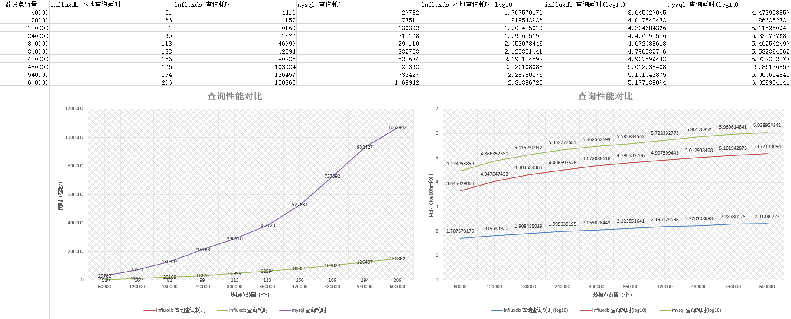

# Preset Source Implements - 预设数据源实现

## 说明

本文档详细说明了本项目内置的所有数据源。

所有内置数据源的代码均位于 `com.dwarfeng.fdr.impl.handler.source` 包的下属包中，
您可以通过查看该包下的所有类来了解本项目内置的所有数据源。

项目中所有的内置数据源如下：

| 名称                     | 说明                            |
|------------------------|-------------------------------|
| DctiKafkaSource        | 基于 dcti 协议的 kafka 数据源         |
| DwarfengDctKafkaSource | 基于 dwarfeng-dct 框架的 kafka 数据源 |
| HistoricalMockSource   | 历史模拟数据源                       |
| RealtimeMockSource     | 实时模拟数据源                       |

## DctiKafkaSource

### 介绍

DctiKafkaSource 是基于 dcti 协议的 kafka 数据源。它从 kafka 特定的 topic 中读取文本数据，并使用 dcti 协议解析数据。

Dcti 协议可以将一个数据信息 `DataInfo` 序列化为文本，并可以从文本反序列化为 `DataInfo`。

`DataInfo` 包含如下字段：

| 字段名          | 类型     | 说明          |
|--------------|--------|-------------|
| pointLongId  | long   | 数据点的 ID     |
| value        | String | 数据点的值，仅支持文本 |
| happenedDate | Date   | 数据点的发生时间    |

该协议被应用于 FDR 1.x，由于 FDR 1.x 的数据值只支持文本，因此该协议适配 FDR 1.x 的需求。

FDR 2.x 支持多种数据类型，该协议作为 FDR 1.x 的兼容，可以从旧的消息队列中读取数据。读取出的数据为文本类型，
您可以直接将文本存储到 FDR 2.x 中，上位应用读取数据后自行转换（在 FDR 1.x 中就是这么做的），
但是这样做会降低数据映射的效率；您也可以对每个数据点定义清洗器，待数据读取后，清洗器会将文本转换为对应的数据类型，

dcti 是一个开源项目，其源码可以在 [Github](https://github.com/DwArFeng/dcti) 或
[Gitee](https://gitee.com/DwArFeng/dcti) 上找到。

该数据源开发于 `1.5.0`，项目升级后对该数据源进行了重构。

### 配置项

该数据源的配置项如下：

```properties
###################################################
#                    kafka.dcti                   #
###################################################
# 引导服务器集群。
source.kafka.dcti.bootstrap_servers=your-ip1:9092,your-ip2:9092,your-ip3:9092
# 会话的超时限制: 如果consumer在这段时间内没有发送心跳信息，一次 rebalance 将会产生。
# 该值必须在[group.min.session.timeout.ms, group.max.session.timeout.ms]范围内，默认: 10000。
source.kafka.dcti.session_timeout_ms=10000
# 新的 group 加入 topic 时，从什么位置开始消费。
source.kafka.dcti.auto_offset_reset=latest
# 监听器启用的消费者的线程数。
# 每一个线程都会启动一个 KafkaConsumer，每个 KafkaConsumer 都会占用一个 partition。
# 程序分布式部署时，所有节点的线程数之和应该小于等于 topic 的 partition 数。
source.kafka.dcti.concurrency=2
# 监听器调用 KafkaConsumer.poll(Duration) 方法的超时时间，如果超过这个时间还没有拉取到数据，则返回空列表。
source.kafka.dcti.poll_timeout=3000
# 监听器的 id，每一个节点的监听器 id 都应与该节点的其它 kafka 监听器的 id 不同。
# 该设置会覆盖 kafka 的 group.id 设置，因此无需设置 group.id。
source.kafka.dcti.listener_id=fdr.source.dcti
# 监听器的目标 topic。
source.kafka.dcti.listener_topic=dcti.data_info
# 监听器的最大拉取数据量。当拉取到的数据量达到这个值时，会立即返回，不会等待 poll_timeout。
source.kafka.dcti.max_poll_records=100
# 监听器的最大拉取间隔。如果当前时间距离监听器上一次拉取数据的时间超过了这个值，一次 rebalance 将会产生。
source.kafka.dcti.max_poll_interval_ms=300000
```

可以看到，配置项有详细的注释，您可以根据注释进行配置。

本文对以下配置进行额外补充说明：

#### source.kafka.dcti.auto_offset_reset

该配置项仅在新的 group 加入 topic 时（即没有 offset 的维护记录时）生效，如果在此之前，group 已经维护了 offset 记录，
则该配置向不生效，而是从 offset 记录的位置开始消费。

该配置可能的值为：

- `latest`：从 topic 的最新位置开始消费。
- `earliest`：从 topic 的最早位置开始消费。
- `none`：如果没有维护 offset 记录，则抛出异常。

## DwarfengDctKafkaSource

### 介绍

DwarfengDctKafkaSource 是基于 dwarfeng-dct 框架的 kafka 数据源。它从 kafka 特定的 topic 中读取文本数据，
并使用 dwarfeng-dct 框架解析数据。

dwarfeng-dct 框架提供了数据编码处理器 - `DataCodingHandler`，该处理器可以将数据接口 `Data` 序列化为文本，
并可以从文本反序列化为 `Data`。

`Data` 接口包含如下方法：

| 方法签名                    | 说明        |
|-------------------------|-----------|
| LongIdKey getPointKey() | 获取数据的点位主键 |
| Object getValue()       | 获取数据的值    |
| Date getHappenedDate()  | 获取数据的发生时间 |

相比 dcti 协议，dwarfeng-dct 框架支持任意类型数据值的序列化和反序列化，因此该数据源可以适配 FDR 2.x 的需求。

dwarfeng-dct 是一个开源项目，其源码可以在 [Github](https://github.com/DwArFeng/dwarfeng-dct) 或
[Gitee](https://gitee.com/DwArFeng/dwarfeng-dct) 上找到。

### 配置项

该数据源的配置项如下：

```properties
###################################################
#                kafka.dwarfeng_dct               #
###################################################
# 引导服务器集群。
source.kafka.dwarfeng_dct.bootstrap_servers=your-ip1:9092,your-ip2:9092,your-ip3:9092
# 会话的超时限制: 如果consumer在这段时间内没有发送心跳信息，一次 rebalance 将会产生。
# 该值必须在[group.min.session.timeout.ms, group.max.session.timeout.ms]范围内，默认: 10000。
source.kafka.dwarfeng_dct.session_timeout_ms=10000
# 新的 group 加入 topic 时，从什么位置开始消费。
source.kafka.dwarfeng_dct.auto_offset_reset=latest
# 监听器启用的消费者的线程数。
# 每一个线程都会启动一个 KafkaConsumer，每个 KafkaConsumer 都会占用一个 partition。
# 程序分布式部署时，所有节点的线程数之和应该小于等于 topic 的 partition 数。
source.kafka.dwarfeng_dct.concurrency=2
# 监听器调用 KafkaConsumer.poll(Duration) 方法的超时时间，如果超过这个时间还没有拉取到数据，则返回空列表。
source.kafka.dwarfeng_dct.poll_timeout=3000
# 监听器的 id，每一个节点的监听器 id 都应与该节点的其它 kafka 监听器的 id 不同。
# 该设置会覆盖 kafka 的 group.id 设置，因此无需设置 group.id。
source.kafka.dwarfeng_dct.listener_id=fdr.source.dwarfeng_dct
# 监听器的目标 topic。
source.kafka.dwarfeng_dct.listener_topic=dwarfeng_dct.data_info
# 监听器的最大拉取数据量。当拉取到的数据量达到这个值时，会立即返回，不会等待 poll_timeout。
source.kafka.dwarfeng_dct.max_poll_records=100
# 监听器的最大拉取间隔。如果当前时间距离监听器上一次拉取数据的时间超过了这个值，一次 rebalance 将会产生。
source.kafka.dwarfeng_dct.max_poll_interval_ms=300000
```

可以看到，配置项有详细的注释，您可以根据注释进行配置。

本文对以下配置进行额外补充说明：

#### source.kafka.dcti.auto_offset_reset

该配置项仅在新的 group 加入 topic 时（即没有 offset 的维护记录时）生效，如果在此之前，group 已经维护了 offset 记录，
则该配置向不生效，而是从 offset 记录的位置开始消费。

该配置可能的值为：

- `latest`：从 topic 的最新位置开始消费。
- `earliest`：从 topic 的最早位置开始消费。
- `none`：如果没有维护 offset 记录，则抛出异常。

## HistoricalMockSource

### 介绍

历史数据源可以根据配置文件中的配置，生成一段时间内的模拟数据。

在配置中指定历史数据的起止时间，两个数据之间的发生时间的增量，以及数据点配置。
数据源会每秒对每个数据点生成一条数据，生成的数据量可以通过配置文件中的配置进行配置，
使用较小的数据量可以降低数据处理与记录的压力，但是会增加数据生成完成的时间。
全部数据生成完成后，数据源将会停止生成数据。

对数据源进行下线操作后，数据源会暂停生成数据。 数据源再次上线后，会从上次生成的数据点开始继续生成数据，而不是重新开始。

该数据的作用是生成一段时间内的历史数据，用于查询性能测试或者演示。

该数据源与复合桥接器可以配合使用，为多个代理桥接器生成相同的历史数据，
随后可以针对每个桥接器进行相同数据点、相同时间段、相同映射信息的查询测试。可以保证测试结果的可比性。

下图展示了一个利用上述机制比较不同桥接器的查询性能的测试结果：



具体细节可以参阅

- [Generate Same Sample Data in Multiple Bridge](./GenerateSameSampleDataInMultipleBridge.md) -
  在多个桥接器生成相同的样本数据。

### 配置项

该数据源的配置项如下：

```properties
###################################################
#                 mock.historical                 #
###################################################
# Mock 历史数据源的随机种子。
source.mock.historical.random_seed=0
# Mock 历史数据源每个数据点每秒的数据量，设置较低的值可以降低数据处理与记录的压力（会增加生成完整数据所需的时间），
# 不影响数据的完整性。
source.mock.historical.data_size_per_point_per_sec=400
# Mock 历史数据源的起始日期，格式为 yyyy-MM-dd HH:mm:ss.SSS。
source.mock.historical.start_date=1992-12-18 00:00:00.000
# Mock 历史数据源的结束日期，格式为 yyyy-MM-dd HH:mm:ss.SSS。
source.mock.historical.end_date=1992-12-19 00:00:00.000
# Mock 历史数据源的数据点发生时间的增量，单位为毫秒。
source.mock.historical.happened_date_increment=1000
# Mock 历史数据源的数据配置。
#   point_type 的可选值如下:
#     int: 整数。
#     long: 长整数。
#     float: 浮点数。
#     double: 双精度浮点数。
#     gaussian: 标准高斯分布。
#     boolean: 布尔值。
#     string: 字符串。
#     int_string: 整数字符串。
#     long_string: 长整数字符串。
#     float_string: 浮点数字符串。
#     double_string: 双精度浮点数字符串。
#     gaussian_string: 标准高斯分布字符串。
source.mock.historical.data_config=[\
  {"point_id":1,"point_type":"int"},\
  {"point_id":2,"point_type":"int"},\
  ]
```

可以看到，配置项有详细的注释，您可以根据注释进行配置。

本文对以下配置进行额外补充说明：

#### source.mock.historical.random_seed

随机种子，除非您希望每此生成的样本数据都完全一样，否则可以不用修改。

## RealtimeMockSource

### 介绍

实时模拟数据源。

实时数据源可以根据配置文件中的配置，生成基于当前时间的模拟数据。
该数据源对每个配置的数据点每秒生成一次数据，每次的生成数量以及类型由配置文件中的配置决定，
生成的数据点的发生时间平均分布在当前时间与上一次生成时间之间。

该数据源的作用是生成实时的模拟数据，用于性能测试或者演示。

关于使用该数据源进行压力测试的细节，可以参阅

- [Conduct Stress Test for Record](./ConductStressTestForRecord.md) - 进行数据采集压力测试。

### 配置项

该数据源的配置项如下：

```properties
###################################################
#                  mock.realtime                  #
###################################################
# Mock 实时数据源的随机种子。
source.mock.realtime.random_seed=0
# Mock 实时数据源每个数据点每秒的数据量。
source.mock.realtime.data_size_per_point_per_sec=400
# Mock 实时数据源的数据配置。
#   point_type 的可选值如下:
#     int: 整数。
#     long: 长整数。
#     float: 浮点数。
#     double: 双精度浮点数。
#     gaussian: 标准高斯分布。
#     boolean: 布尔值。
#     string: 字符串。
#     int_string: 整数字符串。
#     long_string: 长整数字符串。
#     float_string: 浮点数字符串。
#     double_string: 双精度浮点数字符串。
#     gaussian_string: 标准高斯分布字符串。
source.mock.realtime.data_config=[\
  {"point_id":1,"point_type":"int"},\
  {"point_id":2,"point_type":"int"},\
  ]
```

可以看到，配置项有详细的注释，您可以根据注释进行配置。

本文对以下配置进行额外补充说明：

#### source.mock.realtime.random_seed

随机种子，除非您希望每次压力测试接受完全一样的数据，否则可以不用修改。

#### source.mock.realtime.data_size_per_point_per_sec

每个数据点每秒的数据量，该值最好不要超过 `800`，
否则有可能会将两个点的发生时间设置为同一时间，从而导致数据覆写或写入失败。该值是单个数据点的每秒数据生成量，
您可以配置多个数据点，这样每秒数据总量就是 `data_size_per_point_per_sec` 乘以数据点的数量。
