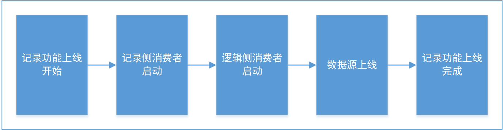
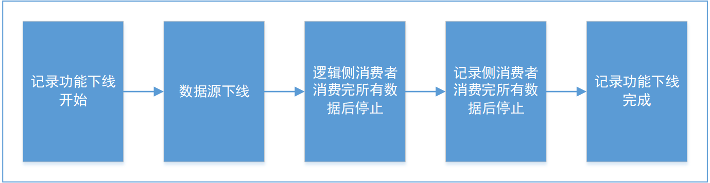

# Source - 数据源

## 说明

数据源是数据采集的来源，是数据采集的第一步。绝大多数数据都需要从数据源中获取然后才能进行数据收集。

FDR 支持两种获取数据的方式，一种是通过其它系统调用 FDR 的记录服务接口，另一种是通过数据源直接向 FDR 提供数据。

调用 FDR 的记录服务接口适用于数据量少，灵活性高的场景，如用户在前端页面上输入数据。调用微服务时，
一切保证数据完整性的机制，如重试、事务等，都需要由调用方自行实现。调用者同时需要考虑如果工程中没有任何 FDR 节点启动，
或者所有 FDR 节点都不可用时，应该如何处理。

数据源直接向 FDR 提供数据的方式是 FDR 推荐的方式，也是 FDR 的核心功能之一。
FDR 提供了多种数据源，可以满足大部分的数据采集需求。

## 接口

数据源 `Source` 是一个接口，有如下方法：

| 方法签名                                        | 说明        |
|---------------------------------------------|-----------|
| `void init(Source.Context)`                 | 初始化数据源    |
| `boolean isOnline() throws HandleException` | 判断数据源是否在线 |
| `void online() throws HandleException`      | 将数据源上线    |
| `void offline() throws HandleException`     | 将数据源下线    |

数据源上下文 `Source.Context` 是一个接口，有如下方法：

| 方法签名                                             | 说明   |
|--------------------------------------------------|------|
| `void record(RecordInfo) throws HandleException` | 记录数据 |

具体方法的说明请参阅接口的 JavaDoc。

## 数据源的生命周期

### 初始化

使用人员通过配置 `opt/opt-source.xml` 文件来配置需要初始化的内置爱数据源，也可以在 `optext` 文件夹下编写配置文件，
加载自定义的数据源。

程序启动时，会加载配置文件，并且初始化配置文件中配置的数据源。数据源在初始化后，程序会立即调用 `void init(Source.Context)`
方法，初始化数据源。该方法中，入口参数 `Source.Context` 用于数据源向 FDR 提供数据，数据源需要把该参数保存下来，
在后续的数据记录中使用。

### 上线

当用户执行记录上线指令，或配置文件中配置的启动记录延迟时间到达时，程序会启动记录功能，此时，数据源会随着记录功能的启动而启动。

数据源启动后，会持续监视目标源。如消息队列、数据库等，当目标源有数据到达时，数据源获得数据，将数据转换为 `RecordInfo` 对象，
并调用之前保存的 `Source.Context` 对象的 `void record(RecordInfo)` 方法，将数据记录到 FDR 中。

### 下线

当用户执行记录下线指令，或程序关闭时，程序会关闭记录功能，此时，数据源会随着记录功能的关闭而关闭。

*只有优雅停机时，才会执行记录下线指令。如果使用 `kill -9` 等强制停止程序的方式，程序会直接关闭，不会执行记录下线指令。*

## 工作机制

程序在实例化数据源后，会立即调用 `void init(Source.Context)` 方法，初始化数据源，此时，数据源将 `Source.Context`
对象保存下来，该对象用于数据源向 FDR 提供数据。

随后，数据源不执行任何调度，直到 `void online()` 方法被调用。当 `void online()` 方法被调用时，数据源会启动，
并开始监视目标源。当目标源有数据到达时，数据源会获得数据，将数据转换为 `RecordInfo` 对象，并调用之前保存的
`Source.Context` 对象的 `void record(RecordInfo)` 方法，将数据记录到 FDR 中。

当 `void offline()` 方法被调用时，数据源会停止监视目标源，此时，数据源不会再记录数据。

## 参阅

- [Opt Directory](./OptDirectory.md) - 可选配置目录说明，详细介绍了本项目的可选配置，即 `opt/` 目录下的内容。
- [PresetSourceImplements.md](./PresetSourceImplements.md) - 预设数据源实现，详细说明了本项目内置的所有数据源。

